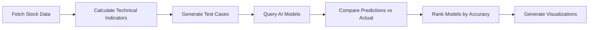

# 🤖📈 LLM Stock Market Technical Analysis Benchmark

> **Can AI predict the stock market?** We put leading Large Language Models to the test with historical stock data and technical analysis. The results might surprise you...

[](https://www.python.org/downloads/)
[](https://opensource.org/licenses/MIT)
[](https://openrouter.ai/)

---

## 📊 What This Does

This project benchmarks **20+ different AI models** on their ability to perform technical analysis and predict stock price movements. We test models from Anthropic, Google, Meta, DeepSeek, and more on real historical data from major tech stocks.

### 🎯 Real Results


**Key Finding**: All models performed below random chance (50%), with the best model (Claude Sonnet 4.5) achieving only 48% accuracy. This suggests that:
- 📉 Short-term stock prediction is extremely difficult
- 🎲 Technical analysis alone has limited predictive power
- 🤖 Even advanced AI can't beat market efficiency
- 📚 See [INSIGHTS.md](INSIGHTS.md) for detailed analysis

---

## 🚀 Quick Start

### 1️⃣ Install Dependencies

```bash
pip install -r requirements.txt
```

### 2️⃣ Get Your (Free!) OpenRouter API Key

1. Visit [OpenRouter.ai](https://openrouter.ai/keys)
2. Sign up and generate a free API key
3. Create a `.env` file:

```bash
echo "OPENROUTER_API_KEY=your_api_key_here" > .env
```

### 3️⃣ Run the Backtest

```bash
python3 backtest_llms.py
```

The script will:
- 📥 Fetch historical data for AAPL, MSFT, GOOGL, TSLA, NVDA
- 📊 Calculate technical indicators (RSI, MACD, Bollinger Bands, etc.)
- 🤖 Test 20+ AI models on predicting price movements
- 💾 Save detailed results to `results/backtest_results.json`

⏱️ **Runtime**: ~15-30 minutes depending on API rate limits

### 4️⃣ Generate Visualizations

```bash
python3 visualize_results.py
```

Creates beautiful charts and graphs showing model performance, saved to `visualizations/` folder.

---

## 📈 Example Visualizations

### Confusion Matrices - What Did Each Model Get Right?


Shows how often each model correctly predicted UP, DOWN, or NEUTRAL movements. Green = correct predictions, darker blue = more predictions.

### Per-Stock Performance - Which Stocks Are Easiest to Predict?


Some models perform better on certain stocks. NVDA showed different patterns than MSFT/AAPL.

### Prediction Distribution - Are Models Biased?


Reveals systematic biases: DeepSeek heavily favored DOWN predictions (bearish), while Claude was more balanced.

### Price Movements - Visual Prediction Timeline


Green bars = correct predictions, Red bars = incorrect. Shows actual price changes for the best-performing model.

### Model Comparison Scatter Plot


Compares model accuracy against number of valid predictions. The red line shows 50% (random chance).

---

## 🎯 What We Tested

### 📊 Technical Indicators
- **Moving Averages**: SMA 20, SMA 50, EMA 12, EMA 26
- **MACD**: Moving Average Convergence Divergence
- **RSI**: Relative Strength Index (14-period)
- **Bollinger Bands**: 20-period with 2 standard deviations
- **Volume Analysis**: Comparison with 20-day average

### 🤖 AI Models (Free Tier)

| Category | Models |
|----------|--------|
| 🧠 **Anthropic** | Claude Sonnet 4.5 |
| 🚀 **xAI** | Grok Code Fast |
| 🔷 **Google** | Gemini 2.0 Flash, Gemma 3 (12B, 27B, 4B) |
| 🔵 **DeepSeek** | DeepSeek V3, R1, R1-0528 |
| 🦙 **Meta** | Llama 4 Maverick/Scout, Llama 3.3 (8B, 70B) |
| 🟣 **Mistral** | Mistral Small 3/3.2 (24B) |
| 🐉 **Qwen** | Qwen3 (235B, 72B, Coder) |
| 🌙 **Others** | Kimi K2, Microsoft MAI, NVIDIA Nemotron, Tencent Hunyuan |

### 📈 Stocks Tested
- **AAPL** - Apple Inc.
- **MSFT** - Microsoft Corporation
- **GOOGL** - Alphabet Inc.
- **TSLA** - Tesla Inc.
- **NVDA** - NVIDIA Corporation

---

## ⚙️ Configuration

Edit `backtest_llms.py` to customize:

```python
# Stocks to test
TICKERS = ['AAPL', 'MSFT', 'GOOGL', 'TSLA', 'NVDA']

# Number of predictions per stock (reduce to speed up)
NUM_TEST_CASES_PER_STOCK = 5

# Add/remove models in TechnicalAnalysisBacktester.__init__()
```

---

## 📊 Output Format

Results are saved as JSON with complete prediction history:

```json
{
  "timestamp": "2025-10-19T17:52:30",
  "rankings": [
    {
      "rank": 1,
      "model": "anthropic/claude-sonnet-4.5",
      "accuracy": 48.0,
      "correct": 12,
      "total": 25
    }
  ],
  "detailed_results": {
    "model_name": {
      "predictions": [
        {
          "ticker": "AAPL",
          "date": "2025-01-17",
          "current_price": 229.17,
          "next_price": 221.85,
          "price_change_pct": -3.19,
          "predicted": "UP",
          "actual": "DOWN",
          "correct": false
        }
      ]
    }
  }
}
```

---

## 🎓 Key Learnings & Insights

### 🔴 Reality Check
- **All models performed below 50%** (worse than random guessing)
- **Best model: Claude Sonnet 4.5 at 48%**
- **Worst model: DeepSeek V3 at 24%**

### 💡 What We Discovered
1. 📉 **Day-to-day movements are essentially random** (efficient market hypothesis confirmed)
2. 🎯 **Technical indicators alone aren't enough** - need fundamentals, news, sentiment
3. 🤖 **Model architecture matters** - Claude outperformed others significantly
4. 📊 **Systematic biases exist** - Some models are bearish, others more balanced
5. 💰 **Don't day trade with AI predictions!** Use them as ONE tool among many

### 📚 Full Analysis
See [INSIGHTS.md](INSIGHTS.md) for:
- Detailed statistical analysis
- Model comparison breakdown
- Recommendations for improvement
- Future research directions
- Practical applications

---

## 🛠️ Technical Features

- ✅ **Robust API Integration** - OpenRouter with automatic retry and rate limiting
- ✅ **Error Handling** - Gracefully handles API failures and timeouts
- ✅ **Comprehensive Logging** - Track progress through thousands of predictions
- ✅ **Scientific Methodology** - Reproducible results with documented approach
- ✅ **Beautiful Visualizations** - Publication-ready charts and graphs
- ✅ **Detailed Reports** - JSON output + text summaries + visual analytics

---

## 📝 How It Works



1. **Data Collection**: Fetches 1 year of historical data via Yahoo Finance
2. **Technical Analysis**: Calculates 10+ indicators (RSI, MACD, Bollinger Bands, etc.)
3. **Test Case Generation**: Creates prediction scenarios with 30-day lookback
4. **AI Prediction**: Each model analyzes data and predicts UP/DOWN/NEUTRAL
5. **Evaluation**: Compares predictions to actual next-day price movements
6. **Ranking**: Sorts models by accuracy and generates comprehensive reports

### 🎯 Classification Logic
- **UP**: Price increase > +0.5%
- **DOWN**: Price decrease < -0.5%
- **NEUTRAL**: Price change between -0.5% and +0.5%

---

## 🚨 Important Notes

- 🔑 **API Key**: Keep your `.env` file safe - it's in `.gitignore`
- ⏱️ **Rate Limits**: Free tier has limits; script includes automatic backoff
- 🐌 **Runtime**: Testing 20 models takes time; reduce test cases to speed up
- 📊 **Market Hours**: Yahoo Finance data may have slight delays
- ⚠️ **Not Financial Advice**: This is for research and education only!

---

## 🤝 Contributing

Found a bug? Have an idea? Contributions welcome!

1. Fork the repo
2. Create a feature branch (`git checkout -b feature/amazing-feature`)
3. Commit changes (`git commit -m 'Add amazing feature'`)
4. Push to branch (`git push origin feature/amazing-feature`)
5. Open a Pull Request

---

## 🎯 Future Improvements

### Short Term
- [ ] Add sentiment analysis from news/social media
- [ ] Test premium models (GPT-4o, Claude Opus)
- [ ] Longer time horizons (3-day, 1-week predictions)
- [ ] More technical indicators (Fibonacci, Ichimoku, etc.)

### Long Term
- [ ] Ensemble methods (combine multiple models)
- [ ] Fine-tune models on financial data
- [ ] Real-time paper trading mode
- [ ] Multi-modal inputs (charts + text)
- [ ] Risk-adjusted metrics (Sharpe ratio, max drawdown)

---

## 📚 Resources & References

- **OpenRouter API**: [https://openrouter.ai/](https://openrouter.ai/)
- **Yahoo Finance**: Historical stock data source
- **Technical Analysis**: Classic indicators and patterns
- **Efficient Market Hypothesis**: Eugene Fama (1970)
- **LLM Benchmarking**: Scientific methodology for AI evaluation

---

## ⚖️ License

MIT License - see [LICENSE](LICENSE) file for details

---

## ⚠️ Disclaimer

**This project is for educational and research purposes only.**

- 📊 Not financial advice
- 💰 Don't invest based solely on these predictions
- 🎲 Past performance doesn't guarantee future results
- 🧪 Results show models perform worse than random chance
- 🔬 Use this as a learning tool, not a trading system

**Always do your own research and never invest more than you can afford to lose.**

---

## 🌟 Star This Repo!

If you found this project interesting or useful, please give it a ⭐! It helps others discover this work.

---

<div align="center">

**Built with 🧠 by testing if AI has 📈 in predicting markets**

*Spoiler: It doesn't (yet!)*

[Report Bug](https://github.com/shreybirmiwal/StockBenchmark/issues) · [Request Feature](https://github.com/shreybirmiwal/StockBenchmark/issues) · [View Results](results/)

</div>
